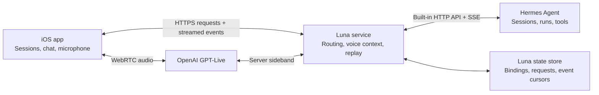

> Historical design: the implemented app now connects directly to Hermes and OpenAI, with user-supplied keys in iOS Keychain and no required Luna helper. See README.md for current setup.

# Luna: iOS voice control for Hermes Agent

Planning baseline: September 18, 2026. This document records the original proposed implementation. A first implementation now exists; see the [README](../README.md) for setup and verification and [implementation decisions](implementation-decisions.md) for the changes made during development.

Build a native iOS app that lets someone open a Hermes session, speak a request, watch the agent's response stream into that session, and hear a useful spoken explanation. Use Nous Research's Hermes Agent and its built-in HTTP connector, as requested. Preserve Hermes' existing session history and execution behavior.

At planning time, the project directory was empty apart from Git metadata. Defaults for planning were iOS 18+, one user, and one configured Hermes installation. Identify connections and profiles separately from day one so additional agents can be added later. The installed Hermes version, host location, network access, and OpenAI account access were designated for verification during the first milestone; see the current verification record for results.

## 1. Architecture

Use SwiftUI for the app, OpenAI GPT-Live for speech, and a small Luna service that connects to Hermes through its existing HTTP API. Run that service beside Hermes initially. It owns voice delegation, authenticated routing, and reconnect state; Hermes continues to own agent execution and durable agent conversations.



GPT-Live supports client delegation to an existing agent or application backend. That is the recommended fit for Hermes. The voice model and Hermes' reasoning model can be selected independently. [OpenAI GPT-Live overview](https://developers.openai.com/api/docs/guides/live)

The server establishes the voice session using the app's WebRTC offer and keeps the project key private. A sideband connection lets the server receive delegation events and return context while audio travels directly between the phone and OpenAI. Native iOS transport compatibility must be proven on a physical device; OpenAI's published quickstart demonstrates the browser flow. [WebRTC connection guide](https://developers.openai.com/api/docs/guides/voice-webrtc?api=live), [server-side controls](https://developers.openai.com/api/docs/guides/voice-server-controls?api=live)

The app therefore controls Hermes through its supported HTTP connector, with Luna mediating requests. No Hermes fork, terminal scraping, or custom Hermes plugin is required by this design. Keeping the server involved also lets an accepted agent run outlive a phone connection.

| Component | Proposed choice | Responsibility |
| --- | --- | --- |
| iOS application | SwiftUI, Swift concurrency | Navigation, chat, microphone controls, accessible rendering |
| Local cache | SwiftData | Cached conversations, drafts, read positions, reconnect cursor |
| Voice transport | Native WebRTC behind a `VoiceTransport` interface | Microphone, playback, connection lifecycle |
| Luna service | Python, FastAPI, asynchronous HTTP client | Authentication, voice context, routing, HTTP connector |
| Service persistence | Separate SQLite database for the first deployment | Request admission, event replay, session bindings |
| Agent connection | `HermesHTTPConnector` | Capability discovery, history, runs, SSE, stop requests |
| Rich text | Evaluate Textual in milestone 1 | Markdown, code, tables, selection |

Keep the Hermes connector and the OpenAI voice adapter replaceable. If GPT-Live is unavailable to the account, evaluate a separate Realtime adapter; do not mix the two APIs' event contracts or endpoint names. GPT-Live uses `gpt-live-1` and the Live API. [GPT-Live model reference](https://developers.openai.com/api/docs/models/gpt-live-1)

## 2. User experience

### Sessions

Show a searchable list of available sessions with title, recent preview, last activity, source, unread indicator, and known run state. Include sessions created outside the app. Label disconnected or stale data clearly. Create and rename sessions; leave deletion and history rewriting outside the first release.

Each session opens its existing history. The header always identifies the agent connection and session. On iPad, use a sidebar beside the conversation; on iPhone, use a session list and conversation screen.

### Conversation

The conversation screen contains streaming Hermes messages, expandable tool activity, a text composer, and a compact voice panel. The panel shows connecting, listening, processing, speaking, muted, or reconnecting states. Users can continue reading and typing during a voice conversation.

Provide distinct controls for **Mute microphone**, **Stop speaking**, **Stop agent**, and **End voice**. Stopping playback or closing voice must not silently cancel an agent run.

Store the exact submitted prompt and show it as the user message. Live captions remain a draft until submission. Label the spoken assistant transcript as voice commentary associated with the relevant Hermes response, so an acknowledgement does not appear to be an agent result.

### Spoken responses

Default to a short explanation of the result, including any failure or action the user needs to take. Keep the complete answer visible in chat. Support “explain the second change,” “read the error,” and “give me more detail” by retrieving the referenced message or block. Avoid reading long code blocks aloud unless requested.

Render content immediately as Hermes emits it. Speak useful progress at natural boundaries, and summarize the final answer once its completion is confirmed. A long agent computation may take time even though audio and text delivery are streaming.

When a background session finishes, update its unread badge. Do not unexpectedly switch screens or speak its contents over the currently selected conversation.

## 3. Hermes HTTP integration

Discover capabilities and pin a tested Hermes release before implementation. Current Hermes documentation exposes the following native integration points. [Hermes API server](https://hermes-agent.nousresearch.com/docs/user-guide/features/api-server)

| App operation | Hermes endpoint |
| --- | --- |
| Discover supported features | `GET /v1/capabilities` |
| List or create sessions | `GET /api/sessions`, `POST /api/sessions` |
| Read a conversation | `GET /api/sessions/{id}/messages` |
| Submit work | `POST /v1/runs` |
| Observe work | `GET /v1/runs/{id}/events`, `GET /v1/runs/{id}` |
| Stop work | `POST /v1/runs/{id}/stop` |
| Stream a session turn directly | `POST /api/sessions/{id}/chat/stream` |

Prefer the Runs interface for the production app. Submit an explicit session ID and let Hermes use its stored conversation. Attach to that run's event stream. Use session-chat streaming for the initial integration experiment or as a capability-gated alternative; never submit through both paths for one request.

The connector converts upstream events into Luna's stable message, tool, and run events. Ignore SSE keepalive comments, handle partial network frames and UTF-8 boundaries, and preserve event order. Capability gaps must produce a clear unsupported-feature state, not an apparently successful operation.

Verify persistence, message identifiers, pagination, concurrent writers, stop behavior, and idempotency against the actual installation. Upstream interfaces evolve. Capture representative payloads as contract fixtures so an upgrade can be checked before deployment.

## 4. Correct session routing

The selected screen is presentation state. It must never determine where an arriving response is saved.

| Record | Required identity and state |
| --- | --- |
| `SessionRef` | Connection ID, profile ID, Hermes session ID |
| `VoiceBinding` | Voice session ID, binding generation, `SessionRef` |
| `Request` | Client request ID, immutable submitted text, `SessionRef`, admission state |
| `Run` | Hermes run ID, request ID, `SessionRef`, execution status |
| `Message` | App ID, upstream ID when available, run ID, role, source, content blocks |
| `Event` | Event ID, replay cursor, session reference, run/message/block IDs as applicable, payload |

At the start of a spoken turn, freeze its target session. The server validates that binding when it admits the request. A request ID survives retries; an OpenAI delegation ID is stored separately from the Hermes run ID.

Every incoming message is reduced into the store keyed by its own session reference. An event for session A updates A even while the user views B. Do not match sessions by title or assume IDs are globally unique across agent installations.

For the first release, switching the active voice target closes the old voice connection and starts one scoped to the new session. Clear queued playback and increment the binding generation. Leave any unsubmitted speech draft attached to its original session. Already admitted work continues there. Old callbacks cannot submit into the new binding.

Resolve voice commands such as “open the deployment session” against the authenticated session inventory. If a title matches multiple sessions, request a choice. Only change the active binding after the server acknowledges the selection. Normal prompts use the frozen target; model-generated names cannot override it.

## 5. Voice delegation flow

1. The user selects a session and starts voice. The app displays that session as the microphone's target.
2. Luna establishes the Live session, attaches its sideband, restores a compact summary of the selected session, and acknowledges readiness before the microphone begins sending.
3. The service collects timestamped transcript fragments. The app can display local captions, but only the server admits Hermes work.
4. A turn assembler groups speech into an application request. A small structured intent router distinguishes submitting a prompt, navigating sessions, asking about an existing result, and stopping a run. It receives only authorized session choices and relevant context.
5. Luna records the request and submits it once through `HermesHTTPConnector`. The exact submitted text becomes visible in the correct conversation.
6. Hermes events update chat continuously. Luna returns concise, verified progress and results to the voice adapter.
7. Follow-up requests use the referenced message and current Hermes session state. Final agent text is retained unchanged, independently of any spoken summary.

**A critical API detail:** Live client-delegation events identify delegated work but do not contain the prompt. Luna must assemble the request from transcript events and application state. Speakable results use `session.commentary.append`; quiet context uses `session.thinking.append`. Keep each update within the documented 500-token limit and preserve its delegation identity. [Client delegation](https://developers.openai.com/api/docs/guides/live-delegation?delegation-mode=client)

Live transcript deltas also lack a final-turn marker. Start with a push-to-talk option that establishes an explicit application speech boundary. Use transcript timing and a tested completeness policy before admission; a button release alone does not prove all transcript text arrived. If completion is uncertain, keep a visible draft for correction rather than submit a partial command. Hands-free mode needs a separately evaluated turn assembler for pauses, corrections, overlapping speech, and delayed transcripts. [Live transcript handling](https://developers.openai.com/api/docs/guides/live-conversations#transcript-deltas)

The intent router should default ordinary speech to the selected session, preserve the user's wording, and avoid inventing arguments. Restrict its output to typed actions; validate everything server-side. Asking for more explanation should use existing results when sufficient, avoiding unnecessary new Hermes executions.

Deduplicate repeated delegation signals against the admitted application turn. New speech during a run becomes either an explicit follow-up or a supported steering request, never an automatic replay of the entire conversation. Implement mid-run steering after the basic path is reliable. Hermes distinguishes queued guidance from consumed guidance, and an accepted stop request from confirmed cancellation. [Hermes programmatic integration](https://hermes-agent.nousresearch.com/docs/developer-guide/programmatic-integration)

## 6. Rich responses while streaming

Keep original Hermes content alongside a derived render model. Represent a message as ordered blocks with stable IDs, such as `markdown`, `code`, `table`, `toolActivity`, `attachment`, and `status`. Use native structured content when provided; otherwise derive presentation from Markdown. These are Luna presentation types, not an assumption that Hermes returns this exact schema.

| Content | First-release behavior |
| --- | --- |
| Text and Markdown | Headings, emphasis, lists, quotes, links, selectable text |
| Code | Language label, syntax highlighting, horizontal scrolling, exact copy |
| Tables | Readable column sizing and horizontal scrolling on small screens |
| JSON and logs | Monospaced display with expandable long output |
| Tool activity | Name, running/completed/error state, available result preview |
| Images and files | Supported URL previews and download/open actions when actually available |
| Unknown structures | Safe, readable fallback preserving the source |

Textual is a candidate because it supports structured SwiftUI text, code highlighting, tables, selection, and accessibility scaling. Test its behavior with incomplete Markdown and large responses before committing to it. [Textual project](https://github.com/gonzalezreal/textual)

Batch screen updates approximately every 50–100 ms rather than rebuilding the full history for every token. Render completed blocks normally and keep the growing tail stable. Incomplete code fences remain a provisional code block; incomplete tables can stay plain text until parseable. Reconcile the whole final message when the run finishes.

Preserve scroll position while users read earlier messages; show a new-content indicator instead of forcing them to the bottom. Virtualize long histories and paginate older messages. Cap expensive highlighting work for very large blocks.

Only display tool details exposed by the connector. Do not promise full tool logs or downloadable local files without a supported retrieval mechanism. Treat rendered text as content: it cannot execute code or issue routing commands. Defer interactive diagrams, complex artifact viewers, and uploads to a later release.

## 7. Recovery and ownership

Hermes is authoritative for agent conversation history. Luna owns voice transcripts, draft state, routing, and its delivery ledger. SwiftData is a local cache. Reconcile optimistic messages against upstream identities so reloading does not duplicate a user prompt or assistant answer.

Use one admitted request per session at a time by default, with visible queued follow-ups. Allow different sessions to run concurrently. Respect Hermes' own writer coordination, including turns originating from another client.

Persist the request before sending it. Where supported, send the same upstream idempotency key on retries and store the returned run ID. If submission outcome is uncertain, reconcile it before attempting new execution. The local ledger alone cannot guarantee exactly-once execution across a lost upstream response.

Luna maintains its own ordered event log and client cursor. A reconnect requests events after the last acknowledged cursor; an expired cursor triggers a session snapshot plus current run status. Do not assume Hermes provides unlimited replay. Continue consuming agent events while the phone is offline, and resynchronize with Hermes after a service restart.

Hermes documents a finite lifetime for detached stream buffers. Its stored message history is also needed for late detached results. Consequently, add bounded refresh of visible sessions and active-run reconciliation instead of treating one stream as the complete history forever. [Hermes stream lifecycle](https://hermes-agent.nousresearch.com/docs/user-guide/features/api-server#runs-api-streaming-friendly-alternative)

Map execution states explicitly: queued, running, waiting for input, stopping, completed, cancelled, failed, or interrupted. A transport disconnect is not a successful run. Preserve partial output on failures and confirm terminal status before the voice assistant announces completion or cancellation.

Foreground voice is the initial product scope. On backgrounding, release voice cleanly while server-side work continues. On return, refresh status and history. Handle phone calls, audio route changes, Bluetooth removal, and denied microphone permission; support text chat when audio is unavailable. [Apple audio interruptions](https://developer.apple.com/documentation/AVFAudio/handling-audio-interruptions)

## 8. Deployment and operating boundaries

For an initial personal deployment, run Luna beside Hermes and reach Luna through authenticated HTTPS on a private network or configured remote endpoint. Store OpenAI and Hermes service credentials on that host; store the app's revocable login token in Keychain. The backend validates ownership on every session, run, and streamed event subscription.

Configure agent connections through trusted setup. Voice input cannot supply arbitrary network destinations. Existing Hermes approval requests should surface in the relevant conversation when supported; the voice model cannot approve its own actions. If the connector cannot carry a required interaction, show that limitation and link the user back to an available Hermes interface.

Store text and operational metadata by default. Application audio recording should be an explicit feature with a retention choice, not an incidental debugging log. Keep full tool results out of general logs and share only context needed for spoken replies.

Track latency separately for voice setup, prompt admission, first Hermes output, visible rendering, and first spoken result. Add usage accounting and an idle voice timeout. Current GPT-Live pricing is $0.05 per session minute, with backend usage separate: a 10-minute session is approximately $0.50 for voice before backend and hosting costs. Recheck pricing before launch. [GPT-Live pricing](https://developers.openai.com/api/docs/models/gpt-live-1)

## 9. Build sequence

Indicative estimate: 5–7 engineering weeks for one experienced iOS developer comfortable with backend work, plus distribution review time. Voice transport compatibility and the installed Hermes version are the largest early uncertainties. The estimates below are planning ranges, not delivery commitments.

| Milestone | Scope | Exit condition | Estimate |
| --- | --- | --- | --- |
| 1. Prove integrations | Identify Hermes version/capabilities; run one streamed turn; list real sessions; prove native Live audio and sideband; test renderer | Physical iPhone speaks to Live; a real Hermes session streams through HTTP | 2–3 days |
| 2. Build text chat | Luna connector and request ledger; session list; history; typed send; run tracking; basic cache | Two sessions can run while replies remain correctly attributed | 4–6 days |
| 3. Add rich streaming | Markdown, code, tables, tool cards, stable scrolling, final reconciliation | Representative long and incomplete responses render correctly | 3–5 days |
| 4. Add voice control | Turn assembly, push-to-talk, intent routing, speech summaries, follow-up details, binding changes | Voice prompt produces one Hermes turn in the intended session | 5–7 days |
| 5. Handle failures | Cursor replay, restarts, lost acknowledgements, audio interruptions, stop state, optional approvals | Disconnect and race-condition scenarios pass without duplicate work | 4–6 days |
| 6. TestFlight pilot | Hands-free evaluation, accessibility, latency measurements, usage controls, device testing | Small pilot can use the complete workflow reliably | 3–5 days |

Build typed session chat before full voice orchestration. It establishes the history, routing, and rendering path that voice will reuse.

Suggested future code organization:

```text
ios/Luna/
  Features/{Connections,Sessions,Chat,Voice}
  Core/{Models,Networking,Persistence,Rendering}
  Integrations/OpenAIVoice/
service/luna/
  api/
  connectors/hermes_http/
  voice/
  routing/
  events/
  persistence/
contracts/
  events/
  fixtures/
```

## 10. Acceptance criteria

1. Existing Hermes sessions and history appear after connecting; the app can create and continue a session.
2. One spoken request produces one admitted prompt, one upstream run, and one persisted user turn.
3. Begin work in A, switch to B, and finish A: all A content remains in A, B remains untouched, and A shows an unread update.
4. Repeat that scenario while a transcript, delegation, and network retry arrive late. The original binding still controls routing.
5. Text, code, tables, and tool states update during execution and survive reload without duplication or source changes.
6. “Explain that error” refers to the correct message and provides spoken details grounded in its content.
7. Stop speaking interrupts playback; Stop agent shows stopping until Hermes confirms the outcome.
8. Losing the phone connection or submission acknowledgement does not start duplicate agent work. Unknown outcomes are reconciled visibly.
9. A service restart restores history and resolves every tracked run to a known or explicitly unknown state; it never fabricates completion.
10. Headset changes, phone calls, microphone denial, and app backgrounding leave a usable conversation and recoverable voice state.
11. Sessions updated outside Luna become visible after refresh. Detached results are found even after the original run stream ends.
12. Unfinished code fences, large tables, long code blocks, and unknown content types remain readable without moving the reader's scroll position.
13. Hands-free evaluation includes hesitation, self-correction, overlapping speech, ambiguous session names, and delayed transcript fragments. Enable it by default only after it meets the same submission and routing criteria as push-to-talk.

Proposed performance targets under defined test-network conditions: visible text within 200 ms of Luna receiving a Hermes delta; local stop-playback response within 250 ms; p50 first spoken acknowledgement within 1.5 seconds of an established voice turn boundary. Measure p95 as well. Agent execution latency is measured separately and cannot be promised by the UI.

## 11. First-release boundary

Deliver session browsing, session creation/continuation, voice and typed prompts, streaming rich chat, useful spoken responses, run status, stop controls, and recovery. Keep the data model ready for multiple agent connections.

After the pilot, add multiple hosts, richer mid-run steering, push notifications with session deep links, background voice if justified by the product, file upload and artifact retrieval where supported, branching, and advanced diagrams. Host reachability and account access are setup decisions for milestone 1; they do not change the core architecture.
